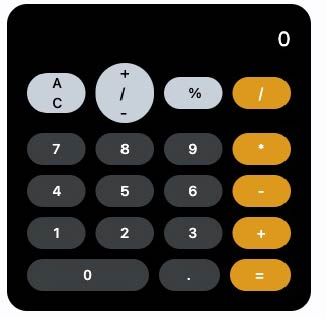

### Flet_Calculator_App

********
Calc App is a sample calculator implemented using Python 3 and Flet framework which enables us to build UI for the program with Flet [controls](https://flet.dev/docs/controls) which are based on [Flutter](https://flutter.dev/) by Google. 

#### Screenshot
*******

#### Requirements
*******
